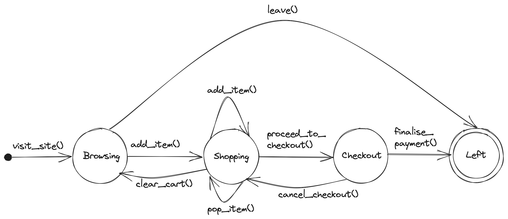
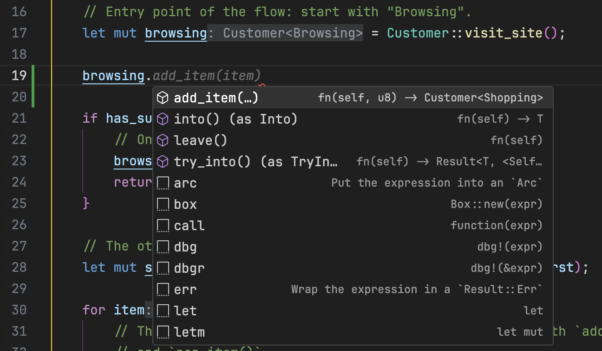

# Typestates (in Rust)

Exploring the application of the [typestate](https://en.wikipedia.org/wiki/Typestate_analysis)
pattern to statically validate a simple online shopping flow. Implemented in Rust v1.70.

**TLDR;** typestates can be incorporated to provide static (compile time) enforcement
of valid state transitions in a program flow. This can lead to the elimination of
certain classes of bugs, resulting in a more robust program and an easier to reason
about codebase. The downside is the cost of the API being slightly more complex and
verbose, as well as its potential impracticality in larger systems.

## Table of contents

- [Motivation and context](#motivation-and-context)
  - [Why](#why)
  - [What](#what)
- [Implementation](#implementation)
- [Results](#results)
  - [Valid state transitions](#valid-state-transitions)
  - [Invalid state transitions](#invalid-state-transitions)
- [Outro](#outro)
- [Readings](#readings)

## Motivation and context

### Why?

When I first encountered [SPARK Ada](https://www.adacore.com/about-spark) in a uni
class on high-integrity systems, I was amazed by some of the property guarantees that
it could provide statically with its "ghost code" annotations. Things that would
normally only get caught by a comprehensive test suite in languages like JS could be
detected by SPARK _before_ the program is even run, which was awesome! Ever since then
I've developed an interest in programs that can encode as many assumptions and
constraints as possible at the type system level, so that they can be statically enforced.

Fast forward to a more recent time, I was reading about
[how to link Rust code with C++ code](https://docs.rust-embedded.org/book/interoperability/rust-with-c.html)
and noticed the ["Static Guarantees"](https://docs.rust-embedded.org/book/static-guarantees/index.html)
section of the document. I then read the section on "typestates" and how the pattern
can be used to enforce valid state transitions at compile time. I wanted to test out
its usage in a real (but simple) program, so here it is 😊

### What?

The state machine that we're representing in this exploration is a simple model of
an online shopping flow. A customer visits an online store, adds some items to the
cart if they want, and then finally checks out to finalise the purchase. A rough sketch
of the state machine is depicted below.



The main objective here is to explore using typestates to implement the model, such that
we would be able to **statically** validate that we are only using valid state transitions.

## Implementation

The source code is available in [`src/`](./src/), but if you'd prefer to read everything
here on this readme instead, feel free to expand the sections below. More bite-sized
chunks of code with explanation are also available in the [Results](#results) section.

<details>
<summary>The library (implementation of the state machine)</summary>

```rust
pub mod online_shop {
    use std::marker::PhantomData;

    // The different states the customer can be in throughout the shopping flow.
    // We can model a "Left" state if we want, but we don't have to.
    pub struct Browsing;
    pub struct Shopping;
    pub struct Checkout;

    // Representation of the online shop customer (the domain entity).
    // The fields are private so we can't instantiate it directly and would have
    // to use the exposed `visit_site()` func as the entry point.
    pub struct Customer<S> {
        shopping_cart: Vec<u8>,
        _inner: PhantomData<S>,
    }

    // This contains the only transitions allowed from the "Browsing" state.
    // The methods take `self` and not `&self` to disable reusing of the value
    // after the method call. If the value is meant to be reused, the methods can
    // return an instance of `Self`.
    impl Customer<Browsing> {
        // This is the only entry point to the flow, starting with "Browsing".
        pub fn visit_site() -> Self {
            println!("Hi site!");
            Customer {
                shopping_cart: vec![],
                _inner: PhantomData,
            }
        }

        // This consumes `self`, so after calling this func we shouldn't be able
        // to use the `Customer` value anymore, which is why we don't need to
        // model the "Left" (end) state explicitly.
        pub fn leave(self) {
            println!("Not buying anything, bye site!");
        }

        // "Browsing" -> "Shopping"
        pub fn add_item(mut self, item: u8) -> Customer<Shopping> {
            self.shopping_cart.push(item);
            println!("Added {} to cart ({:?})", item, self.shopping_cart);
            Customer {
                shopping_cart: self.shopping_cart,
                _inner: PhantomData,
            }
        }
    }

    // This contains the only transitions allowed from the "Shopping" state.
    // The methods take `self` and not `&self` to disable reusing of the value
    // after the method call. If the value is meant to be reused, the methods can
    // return an instance of `Self`.
    impl Customer<Shopping> {
        // "Shopping" -> "Shopping"
        pub fn add_item(mut self, item: u8) -> Self {
            self.shopping_cart.push(item);
            println!("Added {} to cart ({:?})", item, self.shopping_cart);
            self
        }

        // "Shopping" -> "Shopping"
        pub fn pop_item(mut self) -> Self {
            if let Some(popped) = self.shopping_cart.pop() {
                println!("Removed {} from cart ({:?})", popped, self.shopping_cart);
            }
            self
        }

        // "Shopping" -> "Browsing"
        pub fn clear_cart(mut self) -> Customer<Browsing> {
            self.shopping_cart.clear();
            println!("Cart has been cleared.");
            Customer {
                shopping_cart: self.shopping_cart,
                _inner: PhantomData,
            }
        }

        // "Shopping" -> "Checkout"
        pub fn proceed_to_checkout(self) -> Customer<Checkout> {
            println!("Proceeding to checkout.");
            Customer {
                shopping_cart: self.shopping_cart,
                _inner: PhantomData,
            }
        }
    }

    // This contains the only transitions allowed from the "Checkout" state.
    // The methods take `self` and not `&self` to disable reusing of the value
    // after the method call. If the value is meant to be reused, the methods can
    // return an instance of `Self`.
    impl Customer<Checkout> {
        // "Checkout" -> "Shopping"
        pub fn cancel_checkout(self) -> Customer<Shopping> {
            println!("Cancelling checkout, continue shopping.");
            Customer {
                shopping_cart: self.shopping_cart,
                _inner: PhantomData,
            }
        }

        // This, like `leave()`, also consumes `self` and returns nothing, so
        // this transition leads to the end of the flow.
        pub fn finalise_payment(self) {
            println!("Done paying for the items, bye site!");
        }
    }
}
```

</details>

<details>
<summary>The application (how we use the state machine)</summary>

```rust
use stated::online_shop::Customer;

fn main() {
    // This enables the transition `Browsing` -> `Left` via `leave()`
    let has_sudden_change_of_plan = false;

    // This enables the transition `Shopping` -> `Browsing` via `clear_cart()`
    let is_using_mums_credit_card = false;

    // This enables the transition `Checkout` -> `Shopping` via `cancel_checkout()`
    let forgot_my_wallet = false;

    let catalogue: Vec<u8> = vec![20, 42, 36, 13, 71, 100];
    let (first, rest_of_items) = catalogue.split_first().unwrap();

    // Entry point of the flow: start with "Browsing".
    let mut browsing = Customer::visit_site();

    if has_sudden_change_of_plan {
        // One possible transition from "Browsing".
        browsing.leave();
        return;
    }

    // The other possible transition from "Browsing".
    let mut shopping = browsing.add_item(*first);

    for item in rest_of_items {
        // This is just some arbitrary logic to exhibit using both `add_item()`
        // and `pop_item()`.
        if item % 2 == 0 {
            shopping = shopping.add_item(*item);
        } else {
            shopping = shopping.pop_item();
        }
    }

    if is_using_mums_credit_card {
        // One possible "ending" to the flow, via clearing the cart and just leaving.
        browsing = shopping.clear_cart();
        browsing.leave();
        return;
    }

    // The other possible "ending" to the flow, where we actually proceed with
    // checkout and then leave.
    let checkout = shopping.proceed_to_checkout();

    if forgot_my_wallet {
        // This demonstrates another branch where instead of just going forwards,
        // we backtrack.
        shopping = checkout.cancel_checkout();
        browsing = shopping.clear_cart();
        browsing.leave();
        return;
    }

    checkout.finalise_payment();

    // This "default" flow results in this output:
    // Hi site!
    // Added 20 to cart ([20])
    // Added 42 to cart ([20, 42])
    // Added 36 to cart ([20, 42, 36])
    // Removed 36 from cart ([20, 42])
    // Removed 42 from cart ([20])
    // Added 100 to cart ([20, 100])
    // Proceeding to checkout.
    // Done paying for the items, bye site!
}
```

</details>

## Results

Earlier we mentioned that the main objective of this exploration is to _statically_ validate
state transitions. To be more precise, that means the following two conditions have to hold:

- if all state transitions used are valid, the program should compile, and
- if at least one invalid state transition is used, the program should _not_ compile

Let's start with the first one, as it's more straightforward.

### Valid state transitions

The main program only uses valid transitions and it compiles — our job here is done 😎
Even if we toggle the boolean values at the top of the main function, the `return;`
statements in the `if` blocks ensure that we only ever:

- `leave()` **OR** `add_item()` to leave the "Browsing" state,
- `clear_cart()` **OR** `proceed_to_checkout()` to leave the "Shopping" state, and
- `cancel_checkout()` **OR** `finalise_payment()` to leave the "Checkout" state

### Invalid state transitions

Because methods are implemented on specific typestates (`Customer<Browsing>`,
`Customer<Shopping>` etc.), a customer who, for example, is "Browsing" doesn't have
access to methods of the other states, as shown in the picture below. This prevents
bugs where a state uses a transition that is not defined for it!



We also mentioned earlier the `return;` statements ensure that state transitions are
exclusive of one another. To make the code _not_ compile, an easy way is removing them.

```rust
// Removing the first `return;` makes the program no longer compile. This is
// because `leave()` consumes `self`, which ensures that we can no longer use
// `browsing` after we call `leave()` on it. No accidental adding of item after
// the program has left that state, pretty cool!
let mut browsing = Customer::visit_site();
if has_sudden_change_of_plan {
    browsing.leave();
}

// This line complains about use of moved value `browsing`.
let mut shopping = browsing.add_item(*first);
```

```rust
// Removing the second `return;` makes the program no longer compile. This is
// because `clear_cart()` consumes `self`, which ensures that we can no longer
// use `shopping` afterwards. No accidental access to the checkout page if
// we're not currently shopping!
let mut shopping = browsing.add_item(*first);
if is_using_mums_credit_card {
    browsing = shopping.clear_cart();
    browsing.leave();
}

// This line complains about use of moved value `shopping`.
let checkout = shopping.proceed_to_checkout();
```

```rust
// Removing the last `return;` makes the program no longer compile. This is
// because `cancel_checkout()` consumes `self`, which ensures that we can no
// longer use `checkout` afterwards. No accidental payment if we're not in
// the checkout step anymore!
let checkout = shopping.proceed_to_checkout();
if forgot_my_wallet {
    shopping = checkout.cancel_checkout();
    browsing = shopping.clear_cart();
    browsing.leave();
}

// This line complains about use of moved value `checkout`.
checkout.finalise_payment();
```

As shown in the three code blocks above, the methods consuming `self` ensures that
values that are "stale" (in a state we have transitioned out from) can no longer be used,
accidentally or not. This prevents the program from entering an incoherent state,
eliminating bugs like being able to proceed with payment with an empty cart!

## Outro

Overall, implementing typestates has been really fun and educational, and the benefits
are immediately obvious in my opinion. Devs working on this (simple) program can rest
easy knowing that the program cannot (easily) stray away from its intended paths,
and that any invalid state transitions will be met with a compile error (no sneaky
bugs escaping to prod).

(Over)Using this pattern might be too impractical in bigger systems though. I can
see how the mass consuming of `self`, although needed to prevent incoherent states,
can lead to lots of boilerplate and hoops to be jumped through in big codebases
with reassignments all over.

I've seen people talk online about adding more formal "state machine" capabilities to
enums in Rust, but nothing major has really materialised as far as I know (at the
time of writing)? Keen to read more on this area though; maybe in the future Rust
would add more constructs for even more static guarantees of constraints.

## Readings

- https://docs.rust-embedded.org/book/static-guarantees/typestate-programming.html
- https://willcrichton.net/rust-api-type-patterns/typestate.html
- https://blog.yoshuawuyts.com/state-machines-3/
